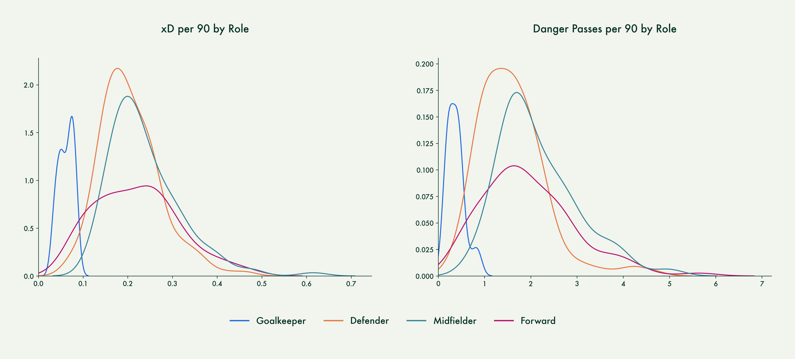
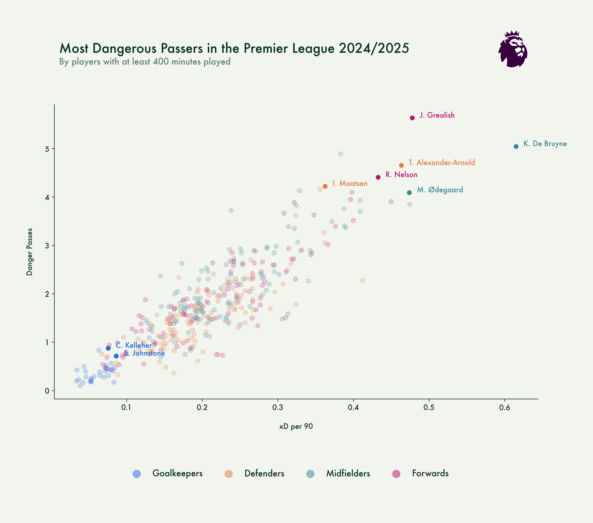

# Project statement

1. Write code to identify passes made within 15 seconds of a shot
2. Use logistic regression to look at how the start and end coordinates of these passes determines the probability that it will be followed by a shot within 15 seconds. Think about how to transform the variables and use non-linear
3. Now do linear regression to look at how the start and end coordinates of the pass determine the probability that the shot is a goal
4. Combine these to give probability of a goal given the start and end coordinates of a pass
5. Rank players (grouped by position) in terms of their Expected Danger per 90. Compare that ranking to number of danger passes made per 90.

## Definitions
**Danger Passes**

Passes that end in a shot within a 15 second period.

**Expected Danger (xD)**

How much danger a player is contributing in attacking moves. This figure is based on the location of the passes a player makes and how likely those passes are going to lead to a goal.

## Distribution of Expected Danger and Danger Passes per 90

In terms of danger on the ball the distribution does make a lot of sense: goalkeepers are not very dangerous and neither are most defenders. The more dangerous players are in midfield and in attack. With midfielders edging out the attackers as they are often the players creating the opportunities for attackers to finish.

## Danger Passes v Expecter Danger per 90

No surprises seeing De Bruyne and Ødegaard top the list for the midfielders. When they're at their best, they elevate their teams to a higher level. With rumours of De Bruyne maybe wanting to stay in the Premier League next season, I'm sure a lot of teams would love to add all that danger to their attack.

I didn't expect Jack Grealish and Reiss Nelson to score this high as they're not the highest profile forwards. Especially Reiss Nelson could be a good pickup for some of the top sides in the league as he's clearly ready for a next step in his career.

We all know how dangerous Trent Alexander-Arnold is on the ball and this graph only confirms that as he's by far the most dangerous defender in the league. Liverpool will surely miss him next season but maybe Ian Maatsen could be a good replacement? Even though he plays on the other side, as far as these metrics are concerned, he is a really interesting player.

Kelleher might be the second choice behind Alisson but he clearly is a good option for teams looking for a goalkeeper who can be dangerous on the ball. Sam Johnstone is another surprise in this list and I'm sure Crystal Palace would like to keep hold of him.