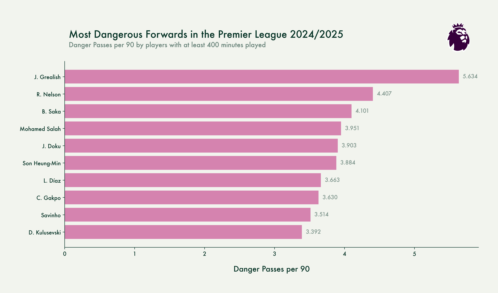
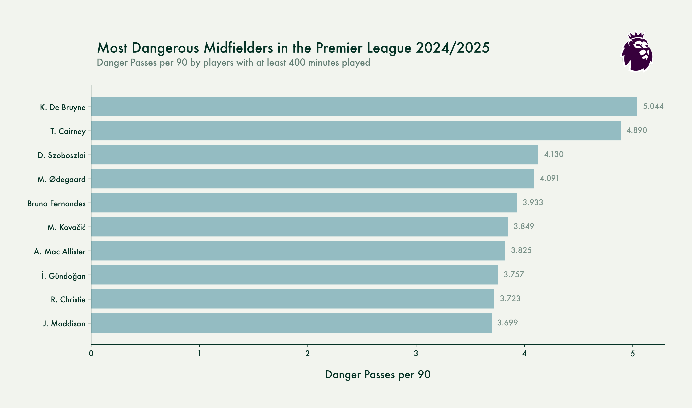
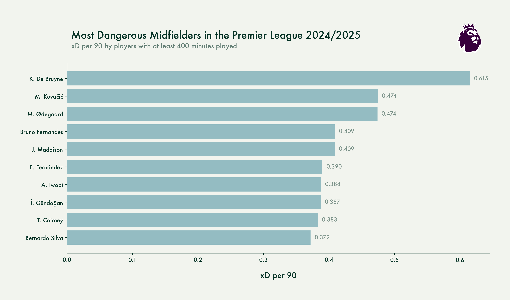
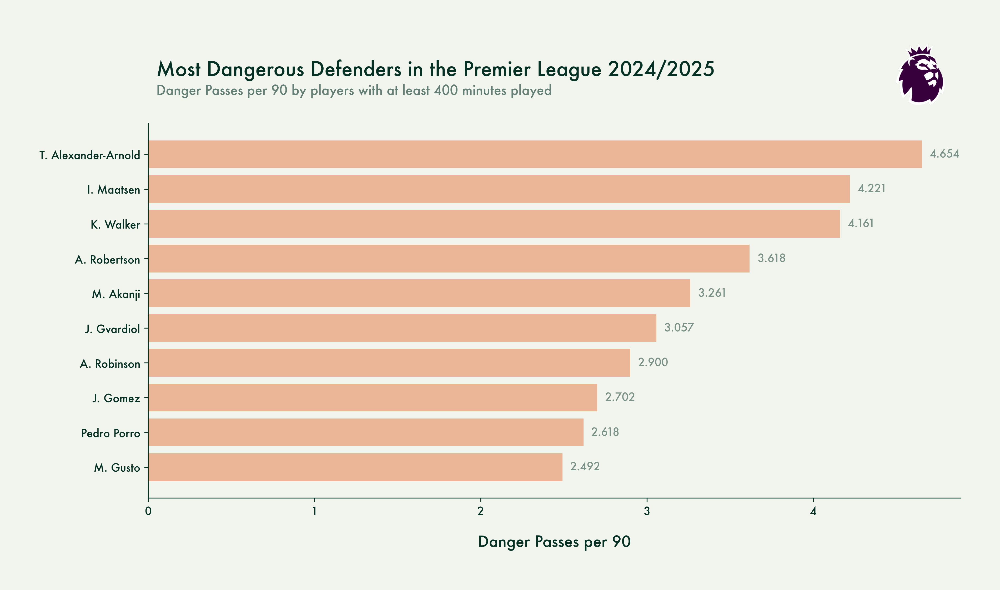
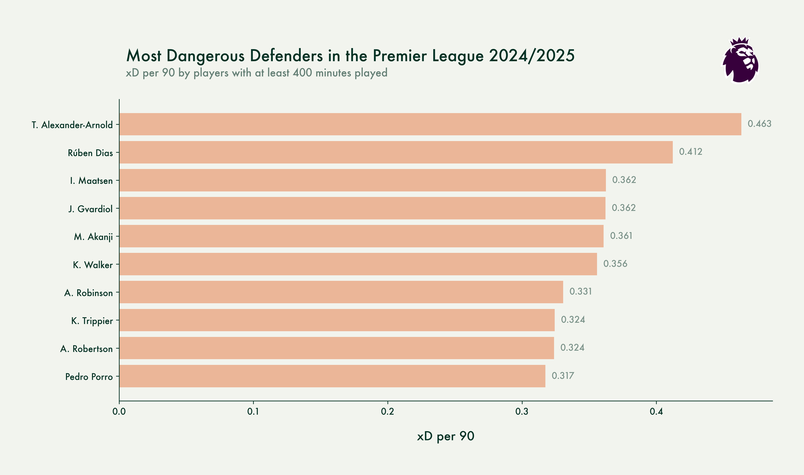
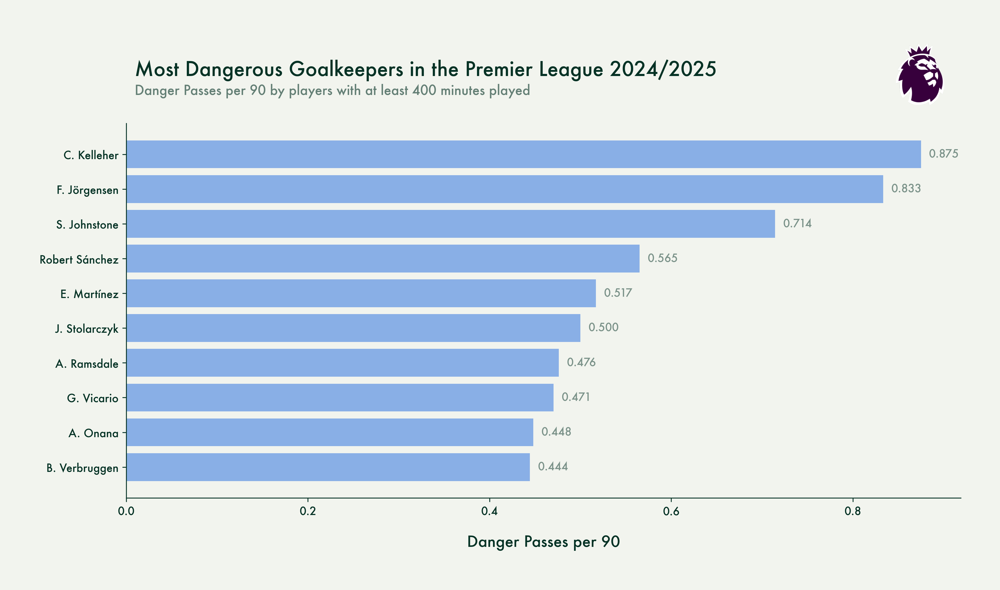
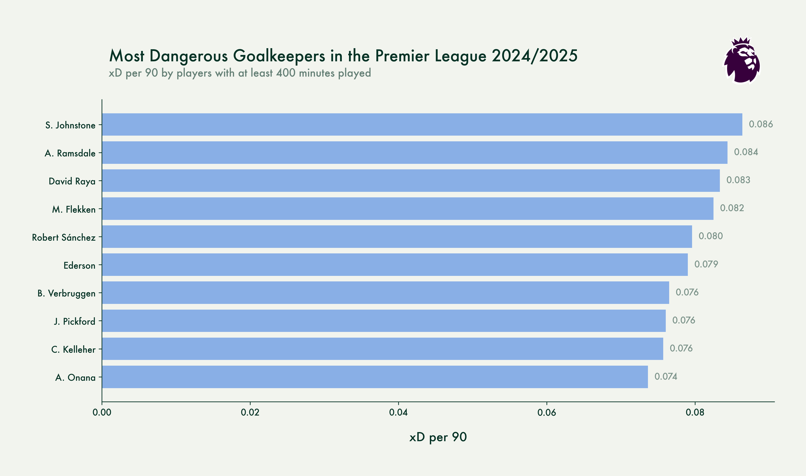

# Soccermatics Pro - Project 2

## Project assignment
Create an Expected Danger model
- Write code to identify all the passes made within 15 seconds of a shot
- Use logistic regression to look at how start and end coordinates of these passes determines the probability that it will be followed by a shot. Think about how to transform the variables and use non-linear transformations of the variables when fitting the model
- Use linear regression to look at how the start and end coordinates of the pass determine the probability of the shot being a goal
- Combine these to give probability of a goal given the start and end coordinates of a pass
- Rank players (grouped by position) in terms of their Expected Danger per 90. Compare that ranking to the number of danger passes made per 90

Notes from course
- Min number of minutes: 300
- Number of minutes to get full idea of a player: 900

## Project feedback
- Possession chains are in wyscout data
- Assigning xG can be done more efficiently:
    - Get shots and their xG
    - Merge with passes on the possession id
- Only use succesful passes
    - Danger passes step can include them now
- Logistic regression: use different model than xgboost
- Feature selection: feature importance en minst belangrijke droppen
- Visualisation: clearly show what x- and y-axis represent
- Top 10s as an appendix is great!

*TODO: complete readme when project is done*

## Pro course xT Duels example
xT berekenen na een duel

Extra kolommen:
- Succesvol duel?
- Kwam er een shot uit de actie na het duel?

Airduels functie: maakt df met features voor models
- Loop door matches > teams > periode
    - Mask maken voor air duels (eventName, teamId en matchPeriod)
    - duels en later airDuels ophalen met .loc op subEventName
    - Mask maken voor shot (eventName, teamId en matchPeriod)
    - shots ophalen
    - Shot window gebruiken om shot_start te berekenen
    - Air duel times berekenen
    - Nieuwe kolom voor duels maken die aanduidt of actie eindigt in een shot
    - Alles samenvoegen
- Succesvolle duels aanduiden
- Locatie features maken
    - X: waar op x-axis
    - Y: waar op y-axis
    - C: verticale afstand tot de centrale lijn
    - Distance: afstand tot het doel
    - Angle: hoe naar het doel
- Andere features
    - Pass lengte (zelfde formule als distance maar met passcoördinaten)
    - Pass hoek (zelfde formule als angle maar met passcoördinaten)

- Data verkennen
    - Verband tussen succesvolle duels percentage en grootte visualiseren -> geeft een idee over de trend van een feature
    - Verband tussen succesvolle duels percentage en gewicht, afstand tot doel, ... visualiseren
    - Verband tussen kans op een shot vergelijken met ...

- Model opstellen
    - Duel win model
    - Shot volgt na duel model -> xT model

- Events linken aan spelers
    - Som van xT per speler
    - Normaliseren met speeltijd -> omzetten naar per 90

- Spelers ranken

## Streamlit app
Filters
- Position
- Team
- Player

Default plots
- Scatter plot: highlight best players per position (xD v num of danger passes)
- Heat map: danger map for one player? position? all players?

Selected player
- Highlight on scatter plot 
- Show danger map for player

## Technologies used

## Filestructure in repository
[./assets](assets)
- Contains fonts, logo's and other assets used for visualisations

[./notebooks](notebooks)
- Contain notebooks used to explore data and set up

# Project description

In this project I used logistic and linear regression to determine the probability of passes being followed by shots and goals (within 15 seconds) by looking at the start and end locations of those passes. Passes that match these criteria are considered "Danger Passes".

These models are then used to assign a value (Expected Danger: xD) to each pass in the 2024/2025 Premier League season before finally ranking players based on their offensive contributions to their teams.

## Distribution of Expected Danger and Danger Passes per 90

In terms of danger on the ball the distribution does make a lot of sense: goalkeepers are not very dangerous and neither are most defenders. The more dangerous players are in midfield and in attack. With midfielders edging out the attackers as they often are the players creating the opportunities for attackers to finish.

## Danger Passes v Expecter Danger per 90

No surprises seeing De Bruyne and Ødegaard top the list for the midfielders. When they're at their best, they elevate their teams to a higher level. With rumours of De Bruyne maybe wanting to stay in the Premier League next season, I'm sure a lot of teams would love to add all that danger to their attack.

I didn't expect Jack Grealish and Reiss Nelson to score this high as they're not the highest profile forwards in the league but they do score some pretty impressive numbers nontheless. Reiss Nelson looks like a good pickup for some of the top sides in the league as he might be ready for a next step in his career.

We all know how skilled Trent Alexander-Arnold is on the ball and this graph only confirms that as he's by far the most dangerous defender in the league. Liverpool will surely miss him next season but maybe Ian Maatsen could be a good replacement? Even though he plays on the other side, as far as these metrics are concerned, he is a really interesting player.

Kelleher might be the second choice behind Alisson but he could be a good option for teams looking for a goalkeeper who can do something with the ball. Sam Johnstone is another surprise in this list and I'm sure Crystal Palace would like to keep hold of him.

## Top 10's

Below are all the top 10's for both Danger Passes and Expected Danger if you're curious to see the rankings in a bit more detail

